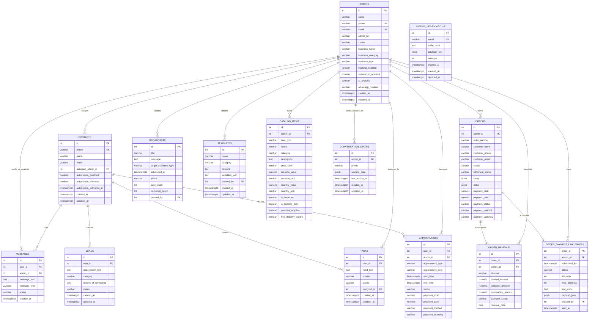
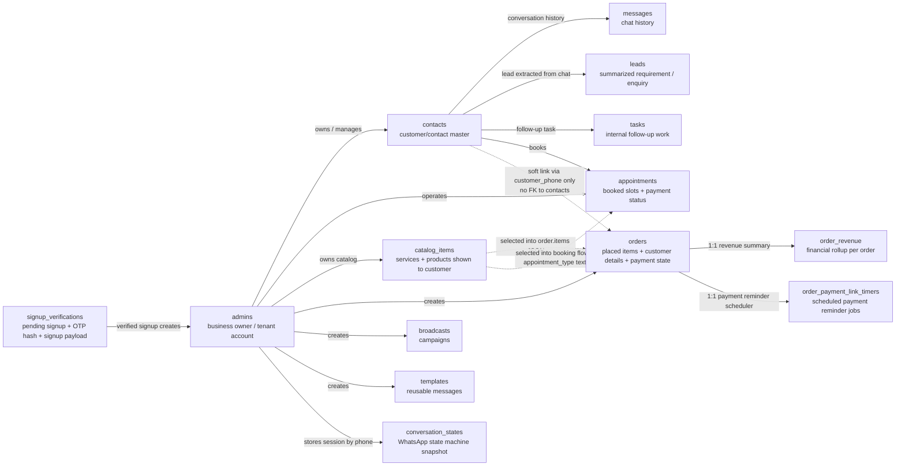

# Algoaura Database Visual

This document maps the active Postgres schema used by the backend and shows:

- which tables exist,
- which tables connect to each other,
- what kind of data each table stores,
- and a live row-count snapshot captured on 2026-03-12.

Schema sources used:

- `db/init.js`
- `migrations/001_create_conversation_states.sql`
- `lib/db-helpers.js`
- `src/whatsapp.js`
- `app/api/auth/signup/route.js`
- `src/persistence/SessionStateManager.js`

## Live Snapshot

Snapshot taken from the configured Postgres database on 2026-03-12.

| Table | Rows | What it currently looks like |
| --- | ---: | --- |
| `admins` | 2 | Two tenant/admin accounts exist |
| `signup_verifications` | 2 | Two pending email verification records |
| `contacts` | 2 | Two saved customer/contact records |
| `messages` | 625 | Main WhatsApp/chat history table |
| `leads` | 45 | Lead summaries extracted from conversations |
| `tasks` | 0 | Table exists but is currently unused |
| `appointments` | 0 | No bookings/appointments stored right now |
| `orders` | 0 | No order records stored right now |
| `order_revenue` | 0 | Revenue rollup table is empty because orders are empty |
| `order_payment_link_timers` | 0 | No scheduled payment reminder jobs right now |
| `broadcasts` | 0 | No saved broadcast campaigns yet |
| `templates` | 0 | No saved message templates yet |
| `catalog_items` | 30 | Product/service catalog is populated |
| `conversation_states` | 0 | No persisted active WhatsApp sessions right now |

## ER View

This view shows hard table relationships backed by foreign keys.



## Flow View

This view adds the soft links and workflow relationships that exist in application logic.



## Connection Rules

- `contacts.assigned_admin_id -> admins.id`
- `messages.user_id -> contacts.id`
- `messages.admin_id -> admins.id`
- `leads.user_id -> contacts.id`
- `tasks.user_id -> contacts.id`
- `tasks.assigned_to -> admins.id` with `ON DELETE SET NULL`
- `appointments.user_id -> contacts.id`
- `appointments.admin_id -> admins.id`
- `orders.admin_id -> admins.id`
- `order_revenue.order_id -> orders.id` and is `UNIQUE`, so one order has one revenue summary row
- `order_revenue.admin_id -> admins.id`
- `order_payment_link_timers.order_id -> orders.id` and is the primary key, so one order has one timer row
- `order_payment_link_timers.admin_id -> admins.id`
- `order_payment_link_timers.created_by -> admins.id` with `ON DELETE SET NULL`
- `broadcasts.created_by -> admins.id` with `ON DELETE SET NULL`
- `templates.created_by -> admins.id` with `ON DELETE SET NULL`
- `catalog_items.admin_id -> admins.id`
- `conversation_states.admin_id -> admins.id`

## Soft Links And Important Design Choices

- `orders` does not have `contact_id`. Customer identity is saved directly in `customer_name`, `customer_phone`, and `customer_email`.
- `appointments` does not have `catalog_item_id`. The booked offering is stored as text in `appointment_type` and the flow state.
- `conversation_states` also does not point to `contacts.id`; it is keyed by `(admin_id, phone)`.
- `signup_verifications` is a staging table for account creation. It is not linked with a foreign key because the admin row does not exist yet.
- `order_revenue` is a derived table kept in sync from `orders`.
- `order_payment_link_timers` is a workflow table used by the scheduled Razorpay payment link sender.

## What Data Each Table Stores

### `admins` (2 rows)

Stores tenant accounts plus business-level configuration.

- Identity: `name`, `phone`, `email`, `password_hash`, `admin_tier`, `status`
- Business profile: `business_name`, `business_category`, `business_type`, `business_address`, `business_hours`, `business_map_url`
- Access/control: `access_expires_at`, `reset_token_hash`, `reset_expires_at`
- WhatsApp state: `whatsapp_number`, `whatsapp_name`, `whatsapp_connected_at`
- Automation/AI: `automation_enabled`, `automation_trigger_mode`, `automation_trigger_keyword`, `ai_enabled`, `ai_prompt`, `ai_blocklist`
- Booking settings: `booking_enabled`, `appointment_start_hour`, `appointment_end_hour`, `appointment_slot_minutes`, `appointment_window_months`
- Delivery/catalog limits: `free_delivery_enabled`, `free_delivery_min_amount`, `free_delivery_scope`, `whatsapp_service_limit`, `whatsapp_product_limit`
- Timestamps: `created_at`, `updated_at`

### `signup_verifications` (2 rows)

Temporary signup verification records before an admin account is created.

- Verification: `email`, `code_hash`, `attempts`, `expires_at`
- Staged payload: `payload_json`
- Timestamps: `created_at`, `updated_at`

Example `payload_json`:

```json
{
  "name": "Business Owner",
  "email": "owner@example.com",
  "phone": "+919999999999",
  "business_category": "Salon",
  "business_type": "service",
  "password_hash": "..."
}
```

### `contacts` (2 rows)

Customer/contact master records for each admin.

- Identity: `phone`, `name`, `email`
- Ownership: `assigned_admin_id`, `previous_owner_admin`
- Automation flags: `automation_disabled`, `automation_activated`, `automation_activated_at`
- Timestamps: `created_at`, `updated_at`

### `messages` (625 rows)

Full message history between a contact and an admin.

- Links: `user_id`, `admin_id`
- Content: `message_text`
- Direction/state: `message_type` (`incoming` or `outgoing`), `status` (`sent`, `delivered`, `read`)
- Timestamp: `created_at`

### `leads` (45 rows)

Lead or enquiry summaries derived from the conversation.

- Link: `user_id`
- Business need: `requirement_text`, `category`, `reason_of_contacting`
- Lifecycle: `status` (`pending`, `in_progress`, `completed`)
- Timestamps: `created_at`, `updated_at`

### `tasks` (0 rows)

Internal follow-up work tied to a contact.

- Links: `user_id`, `assigned_to`
- Work item: `need_text`
- Priority/status: `priority`, `status`
- Timestamps: `created_at`, `updated_at`

### `appointments` (0 rows)

Saved bookings or service appointments.

- Links: `user_id`, `admin_id`
- Booking details: `appointment_type`, `appointment_kind`, `start_time`, `end_time`, `status`
- Payment tracking: `payment_total`, `payment_paid`, `payment_method`, `payment_currency`, `payment_notes`
- Timestamps: `created_at`, `updated_at`

Important rule:

- `appointments` has a unique index on `(admin_id, start_time)`, so one admin cannot have two appointments in the same slot.

### `orders` (0 rows)

Customer order header plus item list and payment state.

- Link: `admin_id`
- Customer snapshot: `customer_name`, `customer_phone`, `customer_email`
- Order status: `order_number`, `channel`, `status`, `fulfillment_status`, `delivery_method`, `delivery_address`, `assigned_to`, `placed_at`
- Item payload: `items` JSONB
- Timeline/comments: `notes` JSONB
- Payment: `payment_total`, `payment_paid`, `payment_status`, `payment_method`, `payment_currency`, `payment_notes`, `payment_transaction_id`, `payment_gateway_payment_id`, `payment_link_id`
- Timestamps: `created_at`, `updated_at`

Example `items` JSON:

```json
[
  {
    "id": 12,
    "item_type": "product",
    "name": "Hair Serum",
    "quantity": 2,
    "price": 399,
    "price_label": "INR 399",
    "category": "Hair Care",
    "quantity_value": 100,
    "quantity_unit": "ml",
    "pack_label": "100 ml",
    "duration_label": null,
    "booking_item": false,
    "payment_required": true
  }
]
```

Example `notes` JSON:

```json
[
  {
    "id": "note-1710000000000",
    "message": "Deliver after 6 PM",
    "author": "Customer",
    "created_at": "2026-03-12T10:30:00.000Z"
  }
]
```

### `order_revenue` (0 rows)

Derived financial summary per order. This is written from order data, not separately entered by users.

- Links: `order_id`, `admin_id`
- Revenue facts: `booked_amount`, `collected_amount`, `outstanding_amount`
- Finance classification: `channel`, `payment_currency`, `payment_status`, `payment_method`
- Reporting fields: `revenue_date`, `placed_at`
- Timestamps: `created_at`, `updated_at`

### `order_payment_link_timers` (0 rows)

Queue/scheduler table for sending payment links for outstanding order balances.

- Links: `order_id`, `admin_id`, `created_by`
- Job control: `scheduled_for`, `status`, `attempts`, `max_attempts`, `processing_started_at`, `sent_at`
- Failure/debug: `last_error`
- Flexible job payload: `payload_json`
- Last generated link reference: `last_payment_link_id`
- Timestamps: `created_at`, `updated_at`

Typical `payload_json` use:

- scheduled send context,
- retry metadata,
- payment reminder job data needed by the worker.

### `broadcasts` (0 rows)

Saved outbound campaign definitions.

- Content: `title`, `message`, `target_audience_type`
- Schedule/state: `scheduled_at`, `status`
- Results: `sent_count`, `delivered_count`
- Ownership: `created_by`
- Timestamps: `created_at`, `updated_at`

### `templates` (0 rows)

Reusable message templates.

- Template content: `name`, `category`, `content`
- Variable definition storage: `variables_json`
- Ownership: `created_by`
- Timestamps: `created_at`, `updated_at`

`variables_json` is stored as text but contains a JSON array of variable names/placeholders.

### `catalog_items` (30 rows)

Products and services shown in WhatsApp flows and booking/order flows.

- Link: `admin_id`
- Catalog identity: `item_type`, `name`, `category`, `description`
- Pricing/units: `price_label`, `duration_value`, `duration_unit`, `duration_minutes`, `quantity_value`, `quantity_unit`
- AI/display: `details_prompt`, `keywords`
- Behavior flags: `is_active`, `is_bookable`, `is_booking_item`, `payment_required`, `free_delivery_eligible`, `show_on_whatsapp`
- Sorting: `sort_order`, `whatsapp_sort_order`
- Timestamps: `created_at`, `updated_at`

### `conversation_states` (0 rows)

Persistent WhatsApp conversation state for each `(admin_id, phone)` pair.

- Key: `admin_id`, `phone`
- Session snapshot: `session_data`
- Activity tracking: `last_activity_at`
- Timestamps: `created_at`, `updated_at`

Example `session_data`:

```json
{
  "step": "awaiting_email",
  "name": "John Doe",
  "email": "john@example.com",
  "data": {
    "selectedService": "Hair Spa",
    "totalAmount": 1200
  },
  "aiConversationHistory": [
    { "role": "user", "content": "I need a booking" },
    { "role": "assistant", "content": "Sure, what service do you want?" }
  ],
  "finalized": false
}
```

## Summary

If you want the database in one sentence:

- `admins` is the tenant root.
- `contacts` is the customer root.
- `messages`, `leads`, `tasks`, and `appointments` hang off contacts.
- `catalog_items`, `orders`, `broadcasts`, `templates`, and `conversation_states` hang off admins.
- `order_revenue` and `order_payment_link_timers` hang off orders.
- some business flows use soft links by phone or text instead of strict foreign keys.
